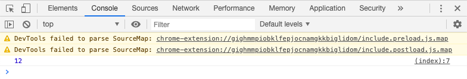

# Quick start

### Create some file with Rapid source code



```javascript
function main(): int {
  return 12
}
```



This is the simplest function named main which returns number 12.

### Use Rapid Compiler

If you don't have it installed yet go to [Compiler](resources/compiler.md) section. Point your `.rapid` file and compile it like:



```bash
$ rapid main.rapid -o main.wasm
```




This will output production-ready _WASM_ binary file ready to use in browser without sourcemaps and without _Webassembly Text Format_. If you want debugging or more outputs see [Compiler](resources/compiler.md) and [Debugging](resources/debugging.md) section.


### Use binary in the browser

Create a simple `.html` file and inject binary:



```bash
<!DOCTYPE html>
<html lang="en">
  <head>
    <meta charset="utf-8" />
    <script>
      WebAssembly.instantiateStreaming(fetch('main.wasm'), {}).then(results => {
        console.log(results.instance.exports.main());
      });
    </script>
  </head>
  <body></body>
</html>
```




This approach is using the compiler directly. You can also use [Rapid CLI](resources/cli.md) to bootstrap development environment in seconds.


### Result

Awesome !



