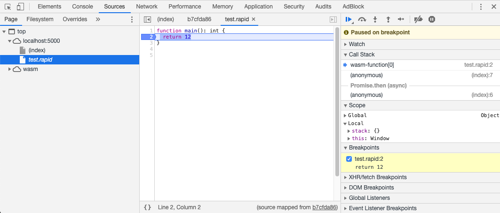

# Debugging

Thanks to **sourcemaps** Rapid can be debugged natively in the browsers dev tools. It's built with developers in mind - that's why you don't need to learn new tooling and new debugging practices.


Sourcemaps are only helpful in development environment while debugging. They are not included in production environment so the security is better and binary size is even smaller.


